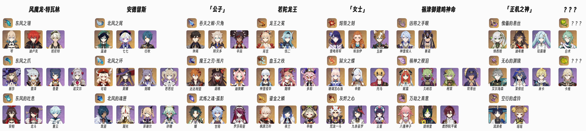

<h1 align="center">FenglinBot_guide</h1></br>


<p align="center">🤖 风林机器人使用说明✨</p></br>

<p align="center"></p>

风林机器人是基于 QQ 平台开发的一款智能聊天机器人，支持多种聊天、娱乐等功能，同时加载了自然语言处理等若干插件，能够提供更多的功能和便利。可以在个人 QQ 聊天、群聊等场景中使用。

## 快速索引

- [快速索引](#快速索引)
- [功能列表](#功能列表)
  - [注意事项](#注意事项)
  - [原神小助手\[N\]](#原神小助手n)
    - [使用方法](#使用方法)
  - [随机二次元\[N\]](#随机二次元n)
  - [xkcd](#xkcd)
  - [“续火”](#续火)
  - [链接解析](#链接解析)
- [FAQ](#faq)
- [赞助](#赞助)
- [特别鸣谢](#特别鸣谢)
- [Copyright](#copyright)


## 功能列表

### 注意事项

命令的格式是这样的：

```QQ
命令名称 参数[可选]
```

- 在大部分情况下，风林仅会对以`/`或`@风林`开头的命令作出回应。而在群聊中，则仅会对以`@风林`开头的命令作出回应。
- 部分功能可能需要特定的权限才能够正常使用，如果尝试使用某个功能时没有反应，可能是因为没有对应权限。如需使用相应插件（开启权限），请联系管理员。
- 部分插件支持自然语言功能，这意味着可以使用更自然的语言来与机器人交互，而不是按照严格的命令格式发送消息。如果一个插件支持自然语言功能，那么在“功能列表”中对应的插件名称旁会标有“[N]”标记。
- 不建议使用 QQ 自带的 "+1" 功能与风林机器人进行交互，因为受 QQ 的功能限制，即使消息中包含 "@风林"，也无法@到机器人。

### 原神小助手\[N]

原神小助手提供了以下功能：

- [x] 米游社Cos区最新/最热Cos图
- [x] 查询当日可以获取的武器/角色天赋突破材料
- [x] 查询周本掉落
- [ ] 米游社养成计算器（尚处于开发阶段）

#### 使用方法

1. Cos图  
命令名称为`原神Cos`

   | 附带参数 | 说明 |
   |:----|:----|
   | 空 | 返回最新Cos图片 |
   | `最新` | 返回最新Cos图片 |
   | `最热` | 返回最热Cos图片 |

   风林将会返回一个合并转发的聊天记录，内含5张Cos图片。  

   所有最新的Cosplay图片都已经通过了筛选，因此图片的质量可以得到保证，并且可以放心使用。然而，由于筛选比例为5%，所以最新的Cosplay图片更新速度较慢，每隔约5小时才会完全更新一次。

   用法示例：

   ```Python
   # 获取最新Cos图
   用户：@风林 原神Cos
   风林：[合并转发的聊天记录]

   # 获取最热Cos图
   用户：@风林 原神Cos 最热
   风林：[合并转发的聊天记录]
   ```

2. 当日材料  
   命令名称为`原神材料`
   | 附带参数 | 说明 |
   |:-------|:----|
   | 空 | 返回今日天赋培养与武器突破材料总图 |
   | `天赋` / `角色` | 返回今日天赋培养材料图片 |
   | `武器` | 返回今日武器突破材料图片 |

   用法示例：   *[结果示例图片（周一/四总图）](image/daily_demo.jpg)*  

   ```Python
   # 获取材料总图
   用户：@风林 原神材料
   风林：[图片]

   # 获取当日武器突破材料
   用户：@风林 原神材料 武器
   风林：[图片]
   ```

   自然语言：你可以用自然语言询问当日可供获取的材料而无需严格遵循上面的命令格式。但是为了避免误触发，在自然语言询问语句中必须出现`原神`关键词。例如：

   ```Python
   用户：@风林 原神今天能刷哪些天赋材料？
   ```

   请注意，自然语言处理的能力有限，所以，询问语句可能会出现无法被识别或识别错误的情况。

3. 周本材料  
   命令名称为`原神周本`
   | 附带参数 | 说明 |
   |:-------|:----|
   | 空 | 返回周本材料总图 |
   | `风龙` / `风魔龙` | 返回 *风魔龙·特瓦林* 掉落材料图片 |
   | `狼` / `北风狼` / `王狼` | 返回 *安德留斯* 掉落材料图片 |
   | `公子` / `达达利亚` / `可达鸭` / `鸭鸭` | 返回 *「公子」* 掉落材料图片 |
   | `若托` / `若陀` / `龙王` | 返回 *若陀龙王* 掉落材料图片 |
   | `女士` / `罗莎琳` / `魔女` | 返回 *「女士」* 掉落材料图片 |
   | `雷神` / `雷电` / `雷军` / `将军` | 返回 *祸津御建鸣神命* 掉落材料图片 |
   | `正机` / `散兵` / `伞兵` / `秘密主` | 返回 *「正机之神」* 掉落材料图片 |

   

   支持自然语言处理，需包含`原神`关键词。例如：
   
   ```Python
   用户：@风林 原神打可达鸭都掉什么？
   ```

### 随机二次元\[N]

   随机发送一张二次元图片，命令名称为`随机`。

   | 附带参数 | 说明 |
   |:--|:--|
   | `图片` | 一张随机图片 |
   | `精选` | 精选图片 |
   | `兽耳` | 兽耳 |
   | `银发` | 银发 |
   | `星空` | 星空 |
   | `竖屏` | 竖向的图片 |
   | `横屏` | 横向的图片 |

   自然语言：可以不加命令和参数中间的空格

### xkcd

看最新一期[xkcd](https://xkcd.com)漫画。命令名称就是`xkcd`
```Python
用户：/xkcd
风林：[漫画标题]
     [漫画图片]
     [文字说明]
```

### “续火”

如果你不知道该发什么，又想和风林保持互动，可以简单地发一个“`火`”字。风林会相应的回你一个“火”。
```
用户：/火
风林：火
```


### 链接解析

## FAQ

## 赞助

## 特别鸣谢


## Copyright

<a rel="license" href="http://creativecommons.org/licenses/by-nc/4.0/"></a><br />This work is licensed under a <a rel="license" href="http://creativecommons.org/licenses/by-nc/4.0/">Creative Commons Attribution-NonCommercial 4.0 International License</a>.

The FenglinBot project includes code adapted and modified from the [nonebot-plugin-gsmaterial](https://github.com/monsterxcn/nonebot-plugin-gsmaterial) by monsterxcn. The original code is licensed under the MIT license, and our modifications are also licensed under the MIT license.

